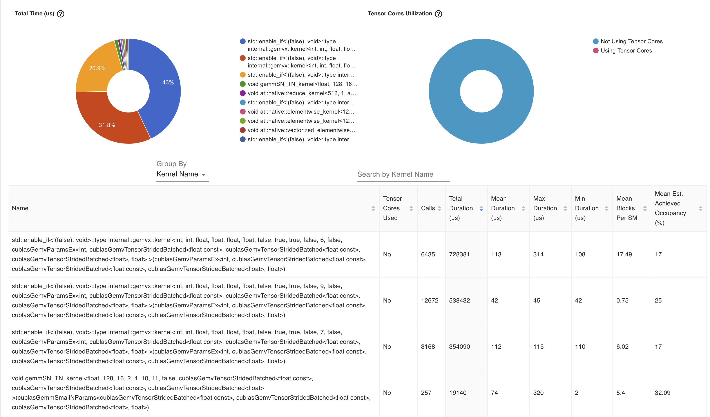

# GEMM Kernel Profiling Analysis (TensorBoard)

TensorBoard 프로파일링 결과를 바탕으로
나이브한 구현 패턴에서 관측된 GEMM 커널의 특성과 역할을 분석한다.
분석 대상은 `cublasGemmEx` 기반의 `gemv::kernel` 계열 커널이다.

---

## 1. 관측 요약

프로파일 결과에서 전체 GPU 실행 시간의 약 90%가 GEMM 연산에 사용되고 있으며,
서로 다른 3개의 GEMM 커널 패턴이 반복적으로 등장한다.

각 커널은 다음과 같은 지표에서 차이를 보인다.

- 호출 횟수 (Calls)
- 평균 실행 시간 (Mean Duration)
- SM 당 블록 수 (Mean Blocks per SM)
- 달성된 Occupancy (Achieved Occupancy)

이를 기준으로 커널을 세 가지 유형으로 분류할 수 있다.

---

## 2. GEMM 커널 유형별 분석

### 2.1 GEMM A: 대형 핵심 GEMM

**특성**
- Calls: 중간 수준
- Mean Duration: 높음 (약 110 µs 이상)
- Mean Blocks per SM: 높음
- Achieved Occupancy: 낮음

**해석**
- 한 번 실행 시 계산량이 큰 GEMM
- 타일 크기가 크고 SM 병렬성이 높음
- 레지스터 또는 shared memory 사용량이 많아 occupancy가 제한됨

**추론되는 역할**
- 모델의 핵심 선형 연산
- 예시:
  - Attention의 QKᵀ
  - Large hidden dimension projection
  - 비교적 큰 행렬에 대한 GEMM

---

### 2.2 GEMM B: 소형 다빈도 GEMM

**특성**
- Calls: 매우 많음
- Mean Duration: 짧음 (약 40 µs)
- Mean Blocks per SM: 매우 낮음
- Achieved Occupancy: 상대적으로 높음

**해석**
- 작은 크기의 GEMM이 반복적으로 호출됨
- SM을 충분히 채우지 못해 병렬성이 낮음
- 커널 실행 시간 대비 launch overhead 비중이 큼

**추론되는 역할**
- 자잘하게 분리된 선형 연산
- 예시:
  - Head-wise projection
  - 작은 batch 또는 짧은 sequence length에서의 GEMM
  - bias / activation fusion이 되지 않은 Linear layer

**성능적 시사점**
- 커널 퓨전 또는 연산 통합의 우선 대상
- FlashAttention, fused MLP 적용 시 가장 큰 개선 여지

---

### 2.3 GEMM C: 중형 보조 GEMM

**특성**
- Calls: 적음
- Mean Duration: GEMM A와 유사
- Mean Blocks per SM: 중간 수준
- Achieved Occupancy: 낮음

**해석**
- 계산량은 크지만 GEMM A 대비 병렬성이 낮음
- 입력 행렬 shape 또는 stride batch 구조가 다름

**추론되는 역할**
- 핵심 GEMM 이후 수행되는 후속 연산
- 예시:
  - Attention output projection
  - Value × Attention weight 연산
  - Sequence length가 감소한 이후의 GEMM

---

## 3. 커널 간 비교 요약

| 구분 | GEMM A | GEMM B | GEMM C |
|----|-------|-------|-------|
| 호출 횟수 | 중간 | 매우 많음 | 적음 |
| 1회 실행 비용 | 큼 | 작음 | 큼 |
| 병렬성 | 높음 | 매우 낮음 | 중간 |
| 성능 병목 | 계산량 | launch overhead | 계산량 |
| 최적화 우선순위 | 중간 | 높음 | 중간 |

---

## 4. 공통적으로 관측된 사항

- 모든 GEMM 커널에서 Tensor Core 미사용
  - `Tensor Cores Used: No`
  - FP32 GEMM 가능성 높음
- `StridedBatched` GEMM 사용
  - batch dimension이 작아 병렬성이 제한될 가능성 존재
- 연산 단위가 과도하게 분리된 구조
  - 나이브한 구현 패턴에 해당

---

## 5. 성능 개선 관점에서의 시사점

1. **소형 다빈도 GEMM(GEMM B) 제거 또는 퓨전이 최우선**
   - 전체 호출 수와 overhead 감소 효과 큼
2. Tensor Core 활용 여부 검토
   - FP16 / BF16 변환 가능성
3. Attention 및 MLP 단위의 fused kernel 적용
4. Nsight Compute를 통한 M/N/K shape 및 register usage 확인

---

## 6. 결론

본 프로파일 결과는 다음과 같은 구조를 시사한다.

- 소수의 대형 핵심 GEMM + 다수의 소형 보조 GEMM
- 전체 성능 병목은 계산량보다는 커널 분해 방식에 있음
- 구조적 최적화 없이 개별 GEMM 최적화만으로는 한계가 명확함

이는 FlashAttention, fused linear/activation, kernel fusion 적용이
효과적인 개선 전략이 될 수 있음을 의미한다.